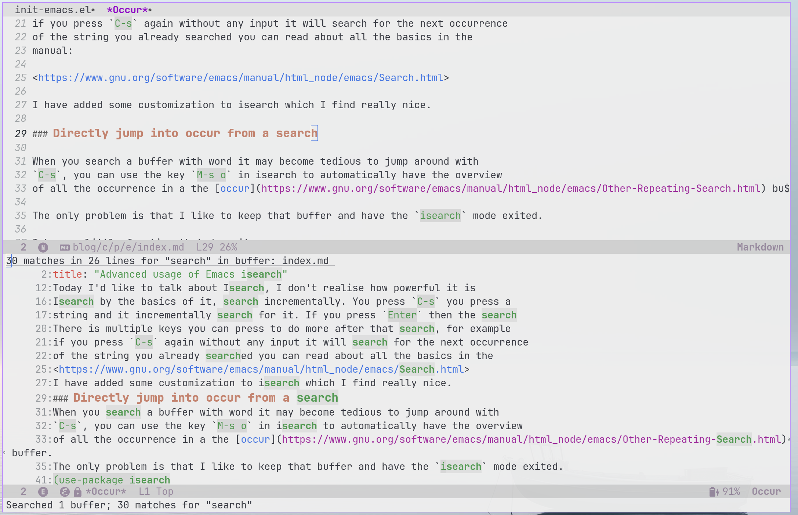
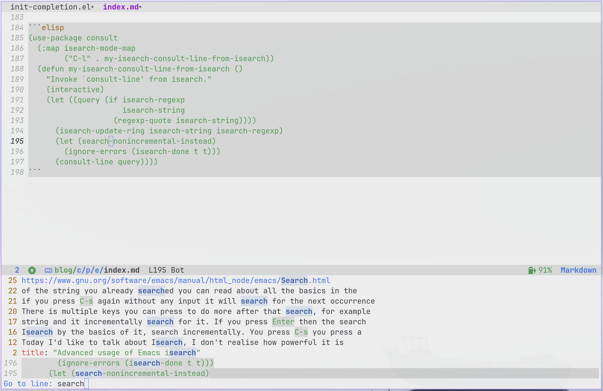
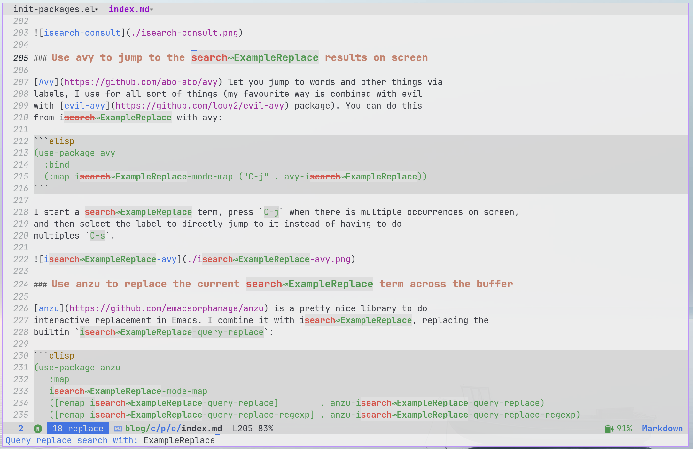

## Introduction

It has been a long time since I have blogged about Emacs. I still enjoy using it
as when I started from day one (around 1998). I did made some changes I have now
moved out of the Emacs keybindings toward using the evil keybinding and have
become proficient using Neovim (for terminal editing) or Vscode (for the
debugger) but Emacs is where my "home" is.

Today I'd like to talk about Isearch, I don't think we realise how powerful
isearch is compared to other editors, the experience out of the box is very
intuitive and powerful and as anything with Emacs you can customize it exactly
the way you want.

The basic of Isearch is to search incrementally for something in your current
buffer. You press `C-s` you press a string and it incrementally search for it. If
you press `Enter` then the search finishes.

There is multiple keys you can press to do more after that search, for example
if you press `C-s` again and you don't have any inputs it will search for the
next occurrences of the string of the previous search, you can read about all
the basics in the manual:

<https://www.gnu.org/software/emacs/manual/html_node/emacs/Search.html>

I have made some customizations to isearch which I find really nice and have
them listed in this blog post.

## Directly jump into occur from a search

When you search a buffer with a word it may become tedious to jump around with
`C-s`, you can use the key combo `M-s o` in isearch to automatically have an
overview of all the occurrences in the
[occur](https://www.gnu.org/software/emacs/manual/html_node/emacs/Other-Repeating-Search.html)
buffer.

I like to keep that buffer and have the `isearch` mode exited. To be able to do
this I have a little function that does it, which I have added via [use-package](https://www.gnu.org/software/emacs/manual/html_node/use-package/index.html):

```elisp
(use-package isearch
  :ensure nil
  :defer t
  :config
  (defun my-occur-from-isearch ()
    (interactive)
    (let ((query (if isearch-regexp
               isearch-string
             (regexp-quote isearch-string))))
      (isearch-update-ring isearch-string isearch-regexp)
      (let (search-nonincremental-instead)
        (ignore-errors (isearch-done t t)))
      (occur query)))
  :bind
  (:map isearch-mode-map
        ("C-o" . my-occur-from-isearch)))
```

With this configuration I simply press `C-s` to start a search, type something I
want to find and then press `C-o` to get a nice window of all occurrences of
that search in the current buffer.



Since I have configured my `display-buffer-alist` variable, the occur window
automatically get focused and I can just press a `n`, `p` to go to the next or
previous occurrence and `q` to discard the window.

Here is a snippet of my configuration for display-buffer-alist:

```elisp
(defun my-select-window (window &rest _)
  "Select WINDOW for display-buffer-alist"
  (select-window window))
(setq display-buffer-alist
      '(((or . ((derived-mode . occur-mode)))
         (display-buffer-reuse-mode-window display-buffer-at-bottom)
         (body-function . my-select-window)
         (dedicated . t)
         (preserve-size . (t . t)))))
```

As a side note, I never really understood how `display-buffer-alist` worked
before watching prot excellent video and blog post about it which is available
here:

<https://protesilaos.com/codelog/2024-02-08-emacs-window-rules-display-buffer-alist/>

## Do a project search from a search term

Now that little function which I used for `occur` could be generalised and
extended for other type of search.

For example, you can do a project search out of the current search word instead of
limiting ourselves to the current buffer:

```elisp
(use-package isearch
  :ensure nil
  :defer t
  :config
  (defun my-project-search-from-isearch ()
    (interactive)
    (let ((query (if isearch-regexp
               isearch-string
             (regexp-quote isearch-string))))
      (isearch-update-ring isearch-string isearch-regexp)
      (let (search-nonincremental-instead)
        (ignore-errors (isearch-done t t)))
      (project-find-regexp query)))
  :bind
  (:map isearch-mode-map
        ("C-f" . my-project-search-from-isearch)))
```

you search a term and you press the `C-f` keys and it will instead do a
search across your current
[project](https://www.gnu.org/software/emacs/manual/html_node/emacs/Projects.html)
with the `project-find-regexp` function.


Note that not much as changed between those functions, and you can easily
generalise this with a
[macro](https://www.gnu.org/software/emacs/manual/html_node/elisp/Macros.html)
or a function, but i'll keep this obvious to make it easy to copy and paste in
your configuration.

## Use the current selection for the initial search (if set)

This comes from an idea of a rather old reddit post:

<https://www.reddit.com/r/emacs/comments/2amn1v/isearch_selected_text/cixq7zx/>

This uses the current selection for the initial selection. I do a selection via
for example an evil operator or via the
[easy-mark function from the easy-kill](https://github.com/leoliu/easy-kill) library and then press `C-s`
to use that selection for the initial search input:

```elisp
  ;; use selection to search
  (defadvice isearch-mode (around isearch-mode-default-string (forward &optional regexp op-fun recursive-edit word-p) activate)
    (if (and transient-mark-mode mark-active (not (eq (mark) (point))))
        (progn
          (isearch-update-ring (buffer-substring-no-properties (mark) (point)))
          (deactivate-mark)
          ad-do-it
          (if (not forward)
              (isearch-repeat-backward)
            (goto-char (mark))
            (isearch-repeat-forward)))
      ad-do-it))
```

I may need to edit that search term, the best way to do edit is to go to the
*edit mode* using the `M-e` key which is bound to the `isearch-edit-string`
function and let you edit the search term with a cursor (ie: not incrementally).

## Select the current symbol at point easily for the search

Many times you want to select the current symbol to start the search, there is
multiple way to do this. In `evil` I can do a selection with `vio` to select the
current symbol and thanks to the defadvice in the previous tip it would
automatically select that symbol for search.

Emacs has a [builtin
way](https://www.gnu.org/software/emacs/manual/html_node/emacs/Symbol-Search.html)
to do this using `M-s .` or since Emacs 28 you can use the function
`isearch-forward-thing-at-point` to directly start a search with the current
symbol.

I find it easier for me to remap the `C-d` key in isearch mode since I find it
easier being close to `C-s` on a qwerty keyboard. I can then just do `C-s C-d`
and I'll get that symbol filled, here is the snippet of my config:

```elisp
(use-package isearch
  :ensure nil
  :defer t
  :bind
  (:map isearch-mode-map
        ("C-d" . isearch-forward-symbol-at-point)))
```

## Use consult to jump onto the search occurrence

Sometime I want to have a interactive way to jump into the current search word,
you can use `consult-line` from the [consult](https://github.com/minad/consult)
package to jump interactively. But if you want to jump from the current isearch
term you can just use that same simple function from earlier and instead `consult-line`
like this:

```elisp
(use-package consult
  (:map isearch-mode-map
        ("C-l" . my-isearch-consult-line-from-isearch))
  (defun my-isearch-consult-line-from-isearch ()
    "Invoke `consult-line' from isearch."
    (interactive)
    (let ((query (if isearch-regexp
               isearch-string
             (regexp-quote isearch-string))))
      (isearch-update-ring isearch-string isearch-regexp)
      (let (search-nonincremental-instead)
        (ignore-errors (isearch-done t t)))
      (consult-line query))))
```

I start a search and press `C-l` and it jumps directly to `consult-line` which I
can further do things with it with preview.



## Use avy to jump to the search results on screen

[Avy](https://github.com/abo-abo/avy) let you jump to words and other things via
labels, I use for all sort of things (my favourite way is combined with evil
with [evil-avy](https://github.com/louy2/evil-avy) package). You can do this
from isearch with avy:

```elisp
(use-package avy
  :bind
  (:map isearch-mode-map ("C-j" . avy-isearch))
```

I start a search term, press `C-j` when there is multiple occurrences on screen,
and then select the label to directly jump to it instead of having to do
multiples `C-s`.


## Use anzu to replace the current search term across the buffer

[anzu](https://github.com/emacsorphanage/anzu) is a pretty nice library to do
interactive replacement in Emacs. I combine it with isearch, replacing the
builtin `isearch-query-replace`:

```elisp
(use-package anzu
  :bind
  (:map
   isearch-mode-map
   ([remap isearch-query-replace]        . anzu-isearch-query-replace)
   ([remap isearch-query-replace-regexp] . anzu-isearch-query-replace-regexp)
   ("C-h"                                . anzu-isearch-query-replace)))
```

I can then start from a search hit the `C-h` key combo and it will ask me for a
new name to replace the searched word to something else.



On the left is the old word being changed and on the right the new word, it's
pretty simple but pretty neat to be able to do this visually.

## Conclusion

There is other ways to supercharge the Emacs Search and it's probably
just a tiny glimpsee of what I know or what I need for my Emacs searching.

There is as well the fantastic [deadgrep](https://github.com/Wilfred/deadgrep)
package which I use often with the `deadgrep-edit-mode` function to do quick
replacement over a project.
