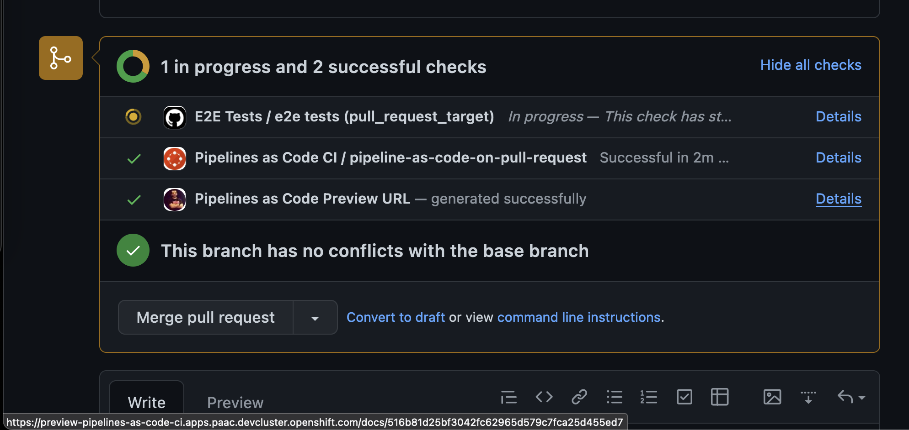

On [`Pipelines as
Code`](htps://github.com/openshift-pipelines/pipelines-as-code) we started to
get a nice documentation website on :

<https://pipelinesascode.com>

The website is statically generated with
[Hugo](https://gohugo.io/) and hosted on [CloudFares
Pages](https://pages.cloudfare.com) using the markdown files from the
repository.

So far that's a pretty standard stack, but what we wanted is to be able to get
preview URLS like what [`netlify`](https://www.netlify.com/) does from `Cloudfare`.

There is a nice check box, that says "Generate Preview URL on Pull Request"
which seems to do what we want but it doesn't. So far it seems that `Pull
Request` coming from forks are not processed only the one from branch coming
from the same repository where the pull request is.

Since we do our own dogfood and we want anyway to use `Pipelines as Code` and
`Tekton` as much as possible, I started to implement a preview environement
mechanism to get a link with the changes from the pull request if the `doc/`
folder is modified inside the PR.

I have again used my toy webserver,
[`go-simple-uploader`](https://github.com/chmouel/go-simple-uploader) (which we
have been used previously for artifacts caching) to serve the static HTML
generate with hugo, but first I had to make a few changes to it:

* Added an OpenShift Route to directly expose it to the internet. It previously
  was only accessible via the local kubernetes service across pods.

* I added a capability to be able to send a tarball when uploading, so we can
  upload a tarball of a folder and stream directly to `go-simple-uploader`
  which will uncompress it on the fly.

* I modified the server to add authentication to the `/upload` endpoint via a
  username and password. Just to make sure nobody abuse from it.

So far so good and after having the new image deployed on our cluster, I
modified our `Pipelines as Code`/`Tekton` template in the `.tekton` directory
to get those preview URLS generated.

The whole bits added is here :

```yaml
      - name: build-doc
        runAfter:
          - fetchit
        taskSpec:
          workspaces:
            - name: source
          steps:
            - name: hugo-gen
              image: quay.io/thegeeklab/hugo
              workingDir: $(workspaces.source.path)
              script: |
                git fetch origin main && \
                  git diff --name-only FETCH_HEAD | grep -q '^docs/' || exit 0
                cd docs
                sed -i '1acanonifyURLs = true' config.toml
                hugo --gc --minify -d {{ revision }} -b https://preview-pipelines-as-code-ci.apps.paac.devcluster.openshift.com/docs/{{ revision }}
                echo "Preview URL: https://preview-pipelines-as-code-ci.apps.paac.devcluster.openshift.com/docs/{{ revision }}"
            - name: upload-to-static-server
              # it has curl and we already pulled it
              image: registry.redhat.io/rhel8/go-toolset:1.16.12-7
              workingDir: $(workspaces.source.path)
              env:
                - name: HUB_TOKEN
                  valueFrom:
                    secretKeyRef:
                      name: "nightly-ci-github-hub-token"
                      key: "hub-token"
                - name: UPLOADER_UPLOAD_CREDENTIALS
                  valueFrom:
                    secretKeyRef:
                      name: "uploader-upload-credentials"
                      key: "credentials"
              script: |
                cd docs
                [[ -d {{ revision }} ]]  || exit 0
                tar czf - {{ revision }} | curl -u ${UPLOADER_UPLOAD_CREDENTIALS} -F path=docs -F targz=true -X POST -F file=@- http://uploader:8080/upload
                # Post as status
                set +x
                curl -H "Authorization: Bearer ${HUB_TOKEN}" -H 'Accept: application/vnd.github.v3+json' -X POST https://api.github.com/repos/{{repo_owner}}/{{repo_name}}/statuses/{{revision}} -d '{"state": "success", "target_url": "https://preview-pipelines-as-code-ci.apps.paac.devcluster.openshift.com/docs/{{ revision }}", "description": "Generated with brio.", "context": "Pipelines as Code Preview URL"}'

```

On the first step we start detecting if we had any changes in the `doc/` folder
using some git trickery with `FETCH_HEAD`, if we didn't have any we will just
`exit 0` and skip it.

If we have some changes, we add a setting to the hugo `config.toml` file to set
`cannonifyURLs=true` so we get canon urls instead of relative.

We are then generating the documentation using `hugo` and we add the new base
which goes to our public `route` URL and the commit sha (via `Pipelines as
Code` variable expansion).

We have another step just after, that would use the username and password from
a secret on a cluster and tar gz the new `docs/` folder on the file to
`go-simple-uploader` which will upload it and uncompress it on the service.

At the end to be able to preview URL, I wasn't sure which place to put it, we
could do slack or as a comment of the pull request but this quickly become
ignore and spammy. Instead, I used the GitHub `statuses` API to post the link
inside the pull request in the CI status place of GitHub, just a click away to
be previewed.

### Links

* [`Pipelines as Code`](https://github.com/openshift-pipelines/pipelines-as-code)
* [`Pipelines as Code pull request template`](https://github.com/openshift-pipelines/pipelines-as-code/blob/main/.tekton/pull-request.yaml)
* [`Go Simple Uploader`](https://github.com/chmouel/go-simple-uploader)


