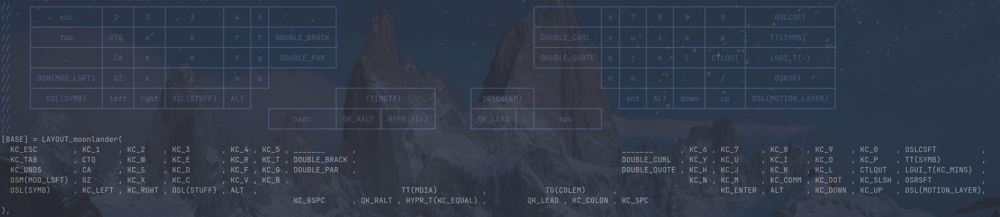
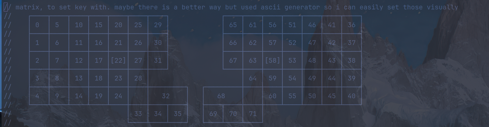

In the winter of 2023, I made the decision to invest in a [ZSA
Moonlander](https://www.zsa.io/moonlander/) keyboard, splurging on a
high-quality and ergonomic device. While my previous Logitech keyboard had not
caused me much discomfort or RSI, I found myself experiencing slight pain in my
thumb when using my Apple Macbook, especially when executing complex commands on
OSX.

After purchasing the Moonlander, I was impressed with its sleek and modern
design. Adapting to the staggered layout took some time and effort, but after a
week of practice, I was able to type at a reasonable speed of 80 WPM and
complete my work with ease.

I spent a considerable amount of time on the "Oryx" interface, searching for the
perfect layout. At first, I attempted to use the default layout, but found it
nearly impossible to adjust to. Next, I tried a traditional Qwerty layout, which
worked for a while but didn't feel optimal. Gradually, I discovered new ways to
customize my keyboard, such as moving the backspace key to my left thumb, which
was much more efficient than reaching to the top right corner of the
keyboard. Additionally, I found the space key on the right thumb to be
incredibly convenient.

It was difficult to adapt to the "Symbols" layer on the keyboard. I eventually
configured the autoshift feature for the symbols located on the number keys, and
moved my other symbols to various locations around the keyboard. Although the
placement of these commonly used programming characters felt a bit unusual, it
was still manageable.

I proceeded to go a bit overboard with numerous macros, double-taps, functions,
and other features that I believed would enhance my productivity. However, I
ended up not utilizing most of them, but I kept them on the keyboard just in
case.

I knew that the Oryx interface was using QMK on the backend and I did look at
the generated firmware but didn't think I would need it until there was some
specific features I wanted from QMK. 

## Features I wanted from QMK

The features I desired from QMK, which were not available in Oryx at the time of writing, include:

- Key overrides: I wished to reverse the functions of the colon and semi-colon
  keys, such that typing once would display `:` and using shift would show
  `;`. I also needed other similar key overrides throughout the keyboard.
- Leader feature: I was interested in trying the Leader feature, similar to the
  `Vim Leader` that I use on Emacs and Neovim. With this feature, multiple keys
  could act as a group for other actions, eliminating the need for multiple
  layers.
- Longer macros: I wanted the ability to create longer macros than the current
  limit of five characters.
- And generally, compiling your firmware and performing tasks independently is a
  fun and satisfying experience.

## Installing QMK

When installing QMK on my Arch Linux, I followed the getting started guide from
the QMK documentation, and the experience was uneventful. I was pleasantly
surprised that everything worked seamlessly from the first attempt. I appreciate
the developers' efforts in making the process as straightforward as possible,
considering that it is not an easy task. After following the guide, I was able
to install the firmware on my keyboard within five minutes.

## Customizing 

I realized that the exported firmware from Oryx had a lot of unnecessary code
that I didn't need and some things that I didn't understand. However, I must
admit that the messiness was partly my own fault because I had imported my
previous keymaps, which had a lot of extra features, into it. Nevertheless, I
decided to start fresh and read the QMK documentation and numerous examples
available in the main repository to create a new firmware for my keyboard.

After initially using Emacs' compilation mode to flash my keyboard, I eventually
switched to vterm, which allowed me to easily interact with the keyboard using
simple keypresses. This was particularly useful for dealing with the
interactivity of the flashing process. Additionally, vterm's integration with
Emacs allowed me to take advantage of its excellent support for C programming.

## Generating the moonlander keyboard ascii arts

One challenge that I encountered while working with QMK is the lack of visual
representation for the key layouts. Although the layout specifications are made
using a simple C struct, it can be difficult to determine which key belongs to
which position on the keyboard. To overcome this, some people include ASCII art
in their code to provide a visual representation of the layout. However,
updating the ASCII art manually can be tedious and error-prone.

Fortunately, I stumbled upon the [qmk.nvim](https://github.com/codethread/qmk.nvim) plugin for Neovim which automates this
process in a very elegant way. It took me just a couple of minutes to come up
with the right configuration for the moonlander:

```lua
require('qmk').setup({
    name = 'LAYOUT_moonlander',
    layout = {
        'x x x x x x x _ _ _ _ _ _ x x x x x x x',
        'x x x x x x x _ _ _ _ _ _ x x x x x x x',
        'x x x x x x x _ _ _ _ _ _ x x x x x x x',
        'x x x x x x _ _ _ _ _ _ _ _ x x x x x x',
        'x x x x x _ _ x^x _ _ x^x _ _ x x x x x',
        '_ _ _ _ _ _ x x x _ _ x x x _ _ _ _ _ _',
    },
})
```

I simply change a key in the struct for my layout and on save, it automatically
generates an ASCII art of the keys and their functions like the one shown below:



## Configuring leds control 

The only thing lacking was getting the LEDs to work. While I don't necessarily
need my keyboard to blink like crazy, it would be nice to have it change colors
when I switch to a different layer or highlight certain keys that I find
difficult to find quickly.

Initially, I tried to make the LED control code work using QMK, but since this
code is generated, it was a bit confusing to use. After reading the proper way
to do it in the QMK documentation and looking at other examples, I finally
figured out a simpler method

I first needed to know where each keys are on the keyboard in the "matrix" which
I have generated with a simple python script and this qmk.nvim plug-in:



and the use the `rgb_matrix_indicators_user` function to set my layer colors and
specific key led colours:

```c
bool rgb_matrix_indicators_user(void) {
    if (rgb_matrix_get_flags() & (LED_FLAG_KEYLIGHT | LED_FLAG_MODIFIER)) {
        switch (get_highest_layer(layer_state)) {
            case BASE:
                rgb_matrix_set_color_all(RGB_TURQUOISE);
                rgb_matrix_set_color(22, RGB_GREEN);   // highlight F key
                rgb_matrix_set_color(58, RGB_GREEN);   // highlight J key
                break;
            case MEDIA:
                rgb_matrix_set_color_all(RGB_RED);
                rgb_matrix_set_color(38, RGB_BLUE); // highlight screenshot key
                break;
        }
    }
    return false;
}
```

## Extracting the keymaps to its own repository

One thing I wanted is to be able to extract my keymap (actually two keymaps
since I have the planck as well) to its own repository instead of having them
inside the QMK main repository and a fork to my username.

I followed a blog post about doing exactly this using git submodules. I could
not figure out what I wanted to do with Makefile so I have instead made a simple
shell script to do the linking and building properly.

Things worked out well and everything is easy to edit recompile.

## Future

I am still experimenting with a few things trying to improve my workflow. 

- I am learning colemak (reaching over 40wpm for now) which is supposed to make me
not moving as much around the keyboard.

- I have moved some of my modifiers to the home rows on each sides where I have
`Control-Alt-Super` which make my thumb pain getting away but having to deal
with trying to find the right timeout to no have some "mistypes". On the other
plus side, the Emacs keys are a real pleasure to use with home row.

- I am still trying to reach to the point where I use all my keys on my
keyboard effectively without having to look at my `keymap.c` which mean I will
have at some point make a cutoff line and say I am not going to change that
keymap again.
