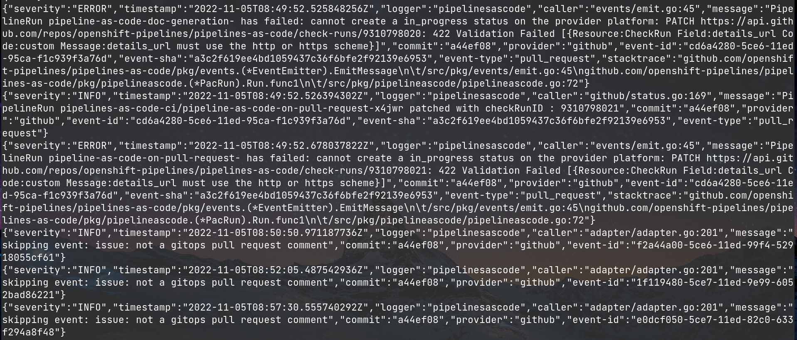
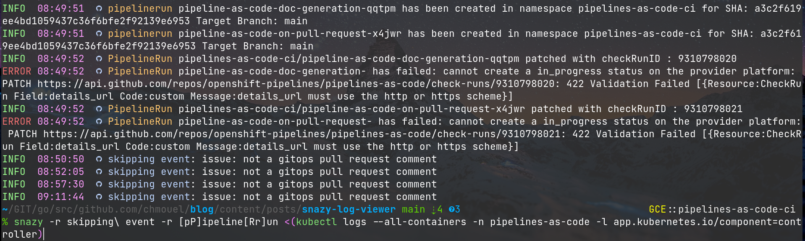
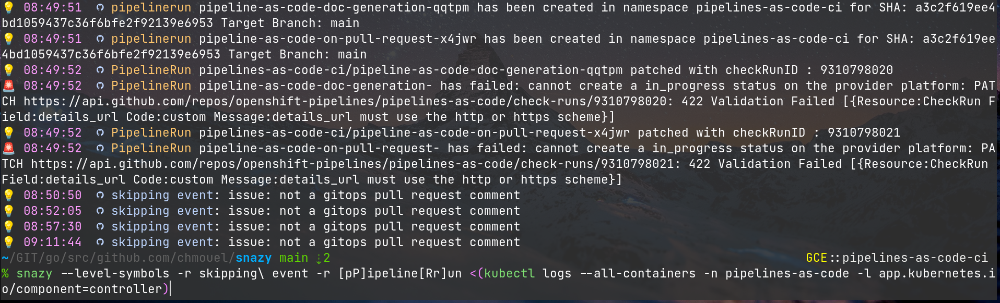
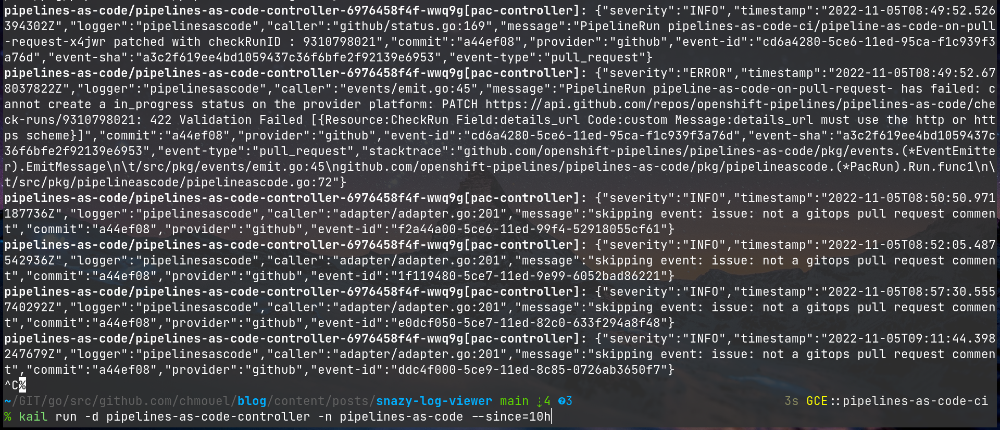
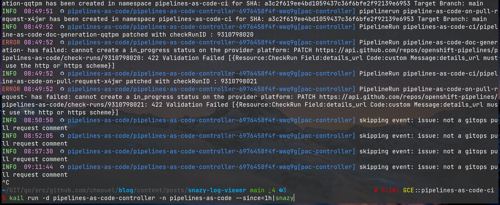

I have been meaning to write an article about tools that I have developed
lately to make it easier for my day to day life work.

Being a so called "Kubernetes cloud native developer" (don't laugh at the title
because I do) I have to watch a log of controller logs. Most controller logs
output in JSON format which is a nice tool for computers but not straightforward to
parse to the eyes of the mere mortals.

As I was getting more annoyed trying to spot my errors in my
controller, I wrote a python script in a haste called it [sugarjazy](https://github.com/chmouel/sugarjazy).

What it did is to make the log output from this :



to this :


I was happy with it and it did job (maybe a bit slow), python makes
it easy to iterate, the cheer nature of the language being all dynamic
and flexible in all kind of way made it easy to parse any sorts of json log. I
think I spent 30 minutes to write it, 30 minutes to package it and be finished and happy with
it.

I was at the same time trying to find a pet project to learn rust and I
thought it would be a good idea to rewrite it in rust.

and boy I was in for a ride…

I read tons and tons of materials on rust, I read the book, I read blog
articles, I read stackoverflow obscure answer to anything, I abused github's
codeassist. I didn't actually understand what I was doing but after a
few days I was able to write a basic version of it in rust.

After that I improved and tried to iterate and improve it, trying to figure out
the best practice and the best way to do things.

It still IMHO pretty bad and probably yet another rewrite to make it proper
Rust, but the good thing with Rust is when it compiles you are pretty confident
it's not going to crash and burn.

The naming of the tool is random called
[snazy](https://github.com/chmouel/snazy) (because I was lazy to find a better
name) and it does what the python version is doing but in rust (in a much faster
way) with a lot more features.

Here is a list of them :

- When you use the `-r` flags (and you can have many of them) you tell snazy to
highlight a regexp in the logs to get to highlight the words you need when it
appears. It would colour the word differently for each regexp you use :



- You can skip some lines you don't want to see with the `-S` flag.

- You can filter the log levels you want to see with the `-f` flag (many `-f` can be specified for multiple levels)

- You can have an action when some word appears. This is pretty useful for example to be able to get notified when something was successful or failed. For example on OSX you can do something like this :

```shell
snazy --action-regexp "script(s)?\s*.*has successfully ran" --action-command "osascript -e 'display notification \"{}\"'"
```

and whenever we've the regexp "script has successfully ran" in the logs, you will get a notification on your mac. (see [notify-send](https://www.mankier.com/1/notify-send) for how to do that on Linux)

- If you want some fancy emojis instead of just boring messages, you can use the `--level-symbols` flag (or set the environment variable `SNAZY_LEVEL_SYMBOLS` in your shell) :



- One  other feature that's most useful for us "cloud native developers" having
to watch multiple containers at the same time is the integration with
[kail](https://github.com/boz/kail) which let you to do that and many more.

Whenever `snazy` detects that you are piping the output of `kail` it will
automatically  show it.

This will get the output from kail like this:



to this :



The blue string is the `namespace/pod[container]` format, if that's a bit too verbose you can use the flag `--kail-prefix-format` or `SNAZY_KAIL_PREFIX_FORMAT` to change it to something else. For example me, I am only interested with pods so I have this set :

```shell
export SNAZY_KAIL_PREFIX_FORMAT="{pod}"
```

and I get this :


I probably should write about my ongoing experience learning Rust and figuring
release and packaging and all that stuff but I think I will do that in another
article.

Until then feel free to grab  snazy from here: <https://github.com/chmouel/snazy>
and happy log viewing (if that's a thing you can be happy with :))
